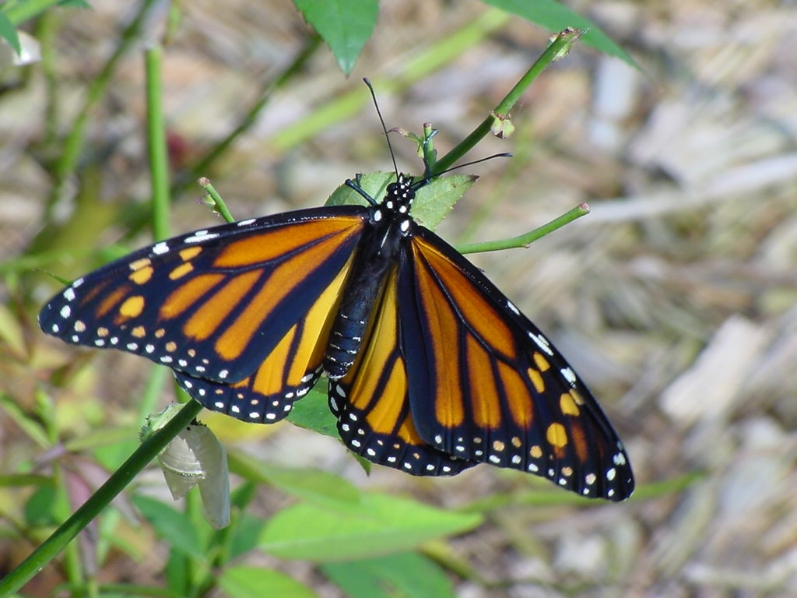
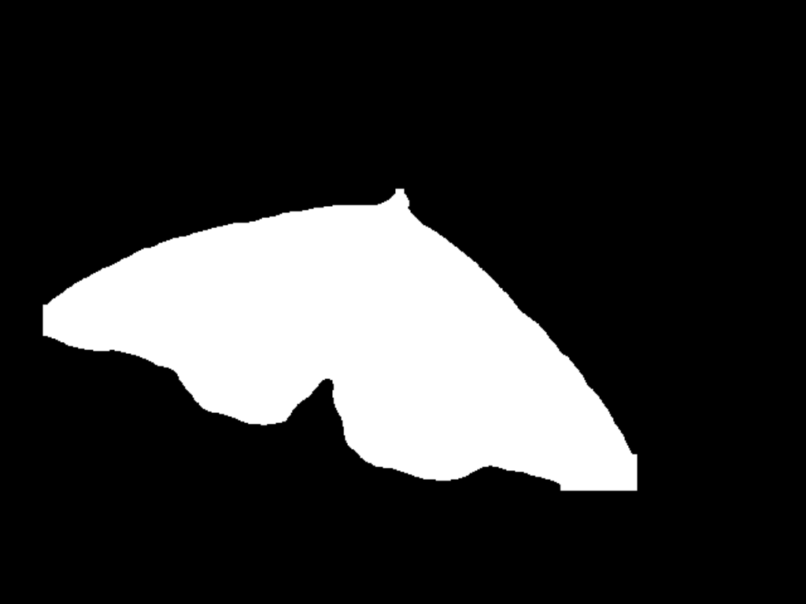
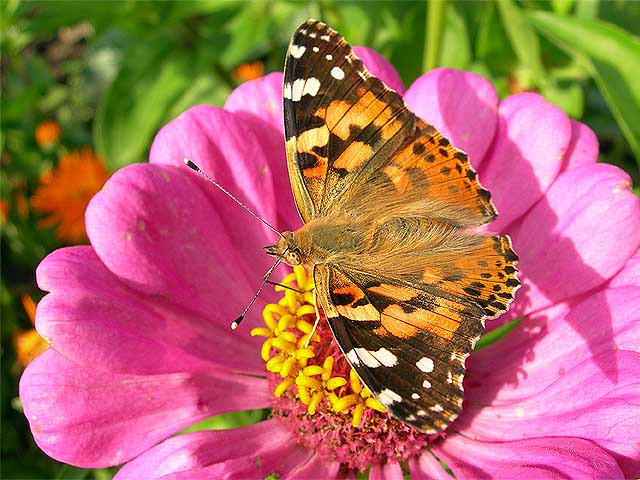
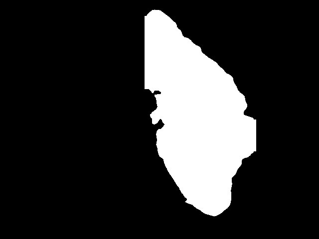
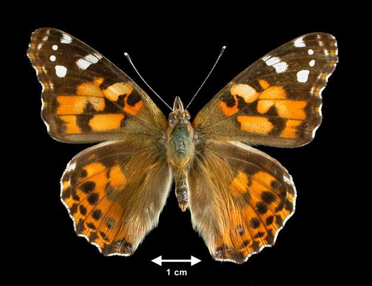
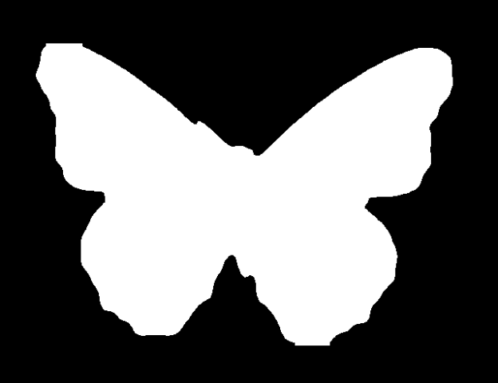

# YOLOv8 Object Detection and Segmentation

This project demonstrates how to perform **object detection and segmentation** using the YOLOv8 model (`yolov8n-seg.pt`) and Streamlit for creating a simple web application. The model is trained on a custom dataset, and you can interact with the model through a web interface to process images and view segmentation results.

Project Link: https://yolo-v8-instance-segmentation.streamlit.app/

## Files in this Project

- **`train.py`**: A script for training the YOLOv8 model on a custom dataset.
- **`predict.py`**: A script to run inference on images using the trained model.
- **`app.py`**: A Streamlit web application that allows users to upload an image or select from a list of predefined images, run segmentation, and download the segmentation mask.

## Requirements

To run this project, you need the following dependencies:

- `Python 3.8 or higher`
- `ultralytics` (for YOLOv8 model)
- `streamlit` (for the web interface)
- `opencv-python` (for image processing)
- `Pillow` (for image manipulation)
- `numpy` (for handling numerical operations)

### Install the necessary dependencies:

```bash
pip install ultralytics streamlit opencv-python-headless pillow numpy 
```
## How to Use the Project

### 1. Training the YOLOv8 Model
Before running the web application, make sure you have trained the YOLOv8 model using your dataset. The `train.py` script is used to train the model. You can modify the `config.yaml` file to specify the paths to your dataset and other configurations.
```bash
python train.py 
```

### 2. Running the Inference Script
After training, use `predict.py` to test the model and generate segmentation masks for a specific image. This script takes an input image and saves the resulting segmentation mask.
```bash
python predict.py 
```
### 3. Launching the Web Application
To interact with the model through a Streamlit web interface, run `app.py`. This will launch a web app where you can either upload your own images or select from a list of predefined images to see the model's segmentation result.
```bash
streamlit run app.py
```
My app will be available locally at http://localhost:8501.

### 4. Interacting with the Streamlit Web App
Select an image: Choose an image from the dropdown menu, which is populated with a list of predefined images from your dataset.
Run Segmentation: Click on the “Run Segmentation” button to generate the segmentation mask.
Download Mask: After the segmentation is complete, you can download the predicted mask as a PNG file.

## Folder Structure

```bash
This_project/
│-- app.py                      # Streamlit web app for segmentation
│-- train.py                    # Model training script
│-- predict.py                  # Inference script for testing model
│-- data/                       # Folder with images for training and testing
│   └── images/
│       ├── train/
│       ├── val/
│-- runs/                        # Folder where trained model weights are stored
│   └── segment/
│       └── train/
│           └── weights/
│               └── last.pt    # Trained YOLO model weights
│-- config.yaml                 # Configuration file for training (paths to datasets, etc.)
└── requirements.txt            # Python dependencies

```
## Input and Output Examples
Here are some examples of images and the resulting segmentation masks generated by the trained model:
### Example 1:
- **Input Image and Output Segmentation Mask:**

  <div style="display: flex;">
    
    
  </div>

### Example 2:
- **Input Image and Output Segmentation Mask:**

  <div style="display: flex;">
    
    
  </div>

### Example 3:
- **Input Image and Output Segmentation Mask:**

  <div style="display: flex;">
    
    
  </div>

You can view these examples within the Streamlit app or try it yourself by selecting an image from the dropdown and running segmentation.

## Model Training Configuration
The `config.yaml` file contains configuration for training the YOLOv8 model, such as dataset paths, image sizes, and other parameters. Make sure to update this file according to your dataset.

## Troubleshooting
1. **No Mask Detected:** If the model doesn't detect any masks, ensure that your dataset annotations are correct and that you're training on the right data format. You can check the training script to confirm the dataset configuration.

2. **Streamlit Issues:** If you encounter issues with Streamlit not running, make sure you have installed all the dependencies and that there are no syntax errors in `app.py`.

## Acknowledgments
- **YOLOv8 by Ultralytics:** The core object detection and segmentation model used in this project.
- **Streamlit:** A framework for building interactive web applications in Python.